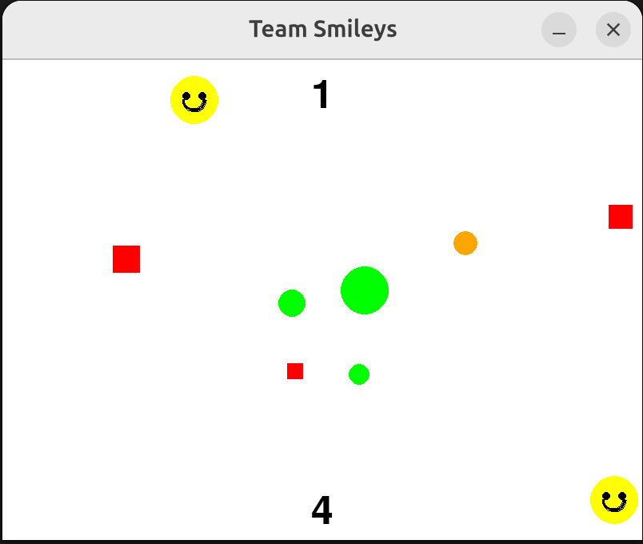

# Auto Pong Game

A fun Pygame-based pong game where players control emojis to hit a bouncing ball. The game features automatic scoring and a win condition.



## Features
- Two-player gameplay
- Emoji-controlled paddles
- Automatic ball movement
- Score tracking
- Win condition at 10 points
- 5-second win celebration
- Automatic game reset

## Controls
- Top player: Left/Right arrow keys
- Bottom player: A/D keys

## Requirements
- Python 3.x
- Pygame

## Installation
1. Clone the repository:
```bash
git clone git@github.com:lisanerd/auto-pong.git
cd auto-pong
```

2. Install dependencies:
```bash
pip install pygame
```

## Running the Game
```bash
python roaming_smileys.py
```

## Game Rules
- The ball bounces between the top and bottom emojis
- Score increases when the ball hits the opposite wall
- First player to reach 10 points wins
- Game automatically resets after a 5-second win celebration 